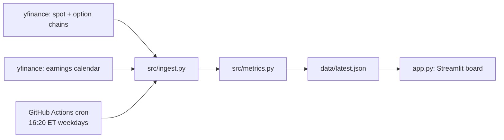

# Earning-Season Premium Pipeline

Automated daily pipeline that prices **earnings-season option premium** across a watchlist of US equities and scores how "rich" it is versus recent realized volatility.

Built as a working data-engineering portfolio project: scheduled ingestion, derived metrics, explicit data-quality handling, and a live dashboard.

## What it answers

For each ticker, every trading day after the close:

> *The options market implies a ±X% move into earnings. Recent realized vol says ±Y%. Is X/Y rich, thin, or fair?*

## Architecture



| Stage | What happens |
|---|---|
| `ingest.py` | Spot price, full option chain, earnings date per ticker. Picks the **cross-earnings expiry** (nearest expiry on/after earnings; ~30d fallback for SPY / missing calendars). |
| `metrics.py` | ATM straddle (call mid + put mid) → implied move %; 30-day realized vol scaled to the same horizon → **richness = implied / realized**. Flags wide/missing quotes. |
| `pipeline.py` | Runs the watchlist, writes `data/latest.json` + dated snapshot in `data/history/`. One bad ticker never kills the run. |
| `app.py` | Streamlit board sorted by richness, with expected ranges and quote-quality flags. |

## Metrics

- **ATM straddle** = ATM call mid + ATM put mid (cross-earnings expiry)
- **Implied move** = straddle / spot
- **Realized baseline** = 30-day daily-log-return std × √DTE (same horizon)
- **Richness** = implied / realized → `>1.2` rich 🔴, `<0.8` thin 🟢, else neutral ⚪
- **Quote quality** = `wide` if any leg is missing or spread/mid > 10%

Known caveat, encoded deliberately: richness compares an *event* implied move against a *quiet-period* realized baseline. A high reading into earnings is usually event premium, not mispricing — the pipeline surfaces the number; judgment stays with the trader.

## Data-quality handling (the interesting part)

- Earnings dates from free calendars are patchy → flagged `earnings_estimated: true`, never presented as confirmed.
- Missing/zeroed quotes → `quote_quality: "wide"`, record kept but distrusted.
- Tickers with no usable chain → recorded with an `error` field, excluded from the board, pipeline keeps running.
- `~` suffix in the UI = estimated date. Verify with the company calendar before trading.

## Quickstart

```bash
python3 -m venv .venv && .venv/bin/pip install -r requirements.txt
TICKERS="SPY,MU" .venv/bin/python src/pipeline.py   # quick test on 2 tickers
.venv/bin/python src/pipeline.py                     # full watchlist
.venv/bin/streamlit run app.py                       # view the board
```

## Scheduling

`.github/workflows/daily.yml` runs the pipeline every weekday at 20:20 UTC (16:20 ET, after the US close) and commits fresh data back to the repo. `workflow_dispatch` allows manual runs.

## Limitations / roadmap

- Quotes are delayed snapshots, not real-time; broker prices remain authoritative.
- yfinance needs direct access to Yahoo Finance — some sandboxed networks block it; GitHub Actions and normal home/office networks are fine.
- Free earnings calendars miss dates — a paid calendar API (e.g. Polygon) would tighten this.
- Roadmap: IV-term-structure curve per ticker, historical richness trends from `data/history/`, alerting on threshold crosses.

## Author

Luo — data engineer. Built to scratch a real itch: systematic premium selling around earnings season.
